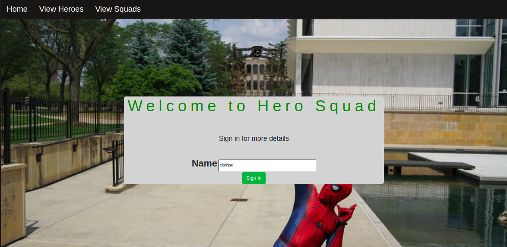
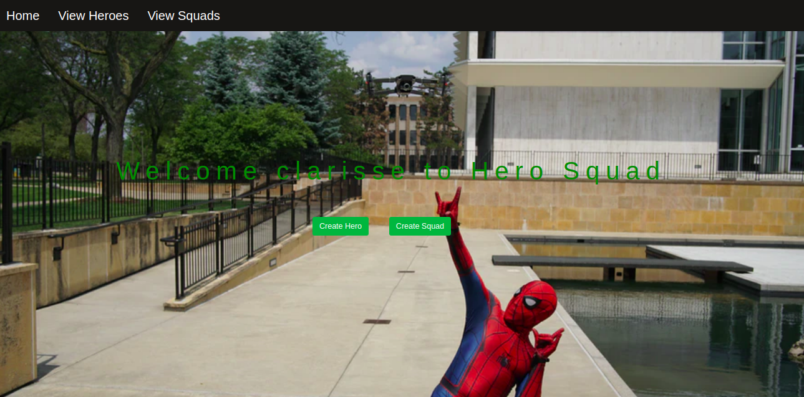
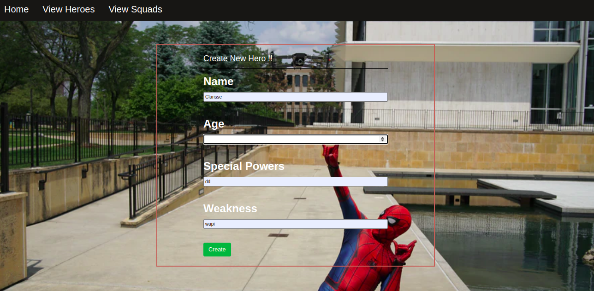
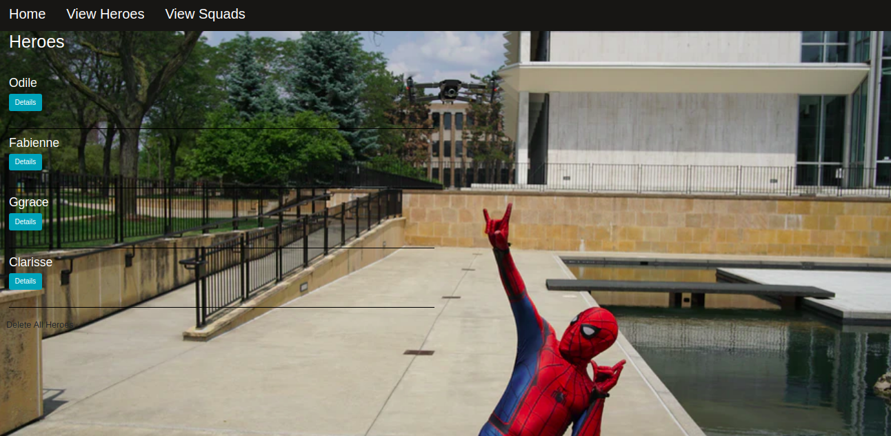
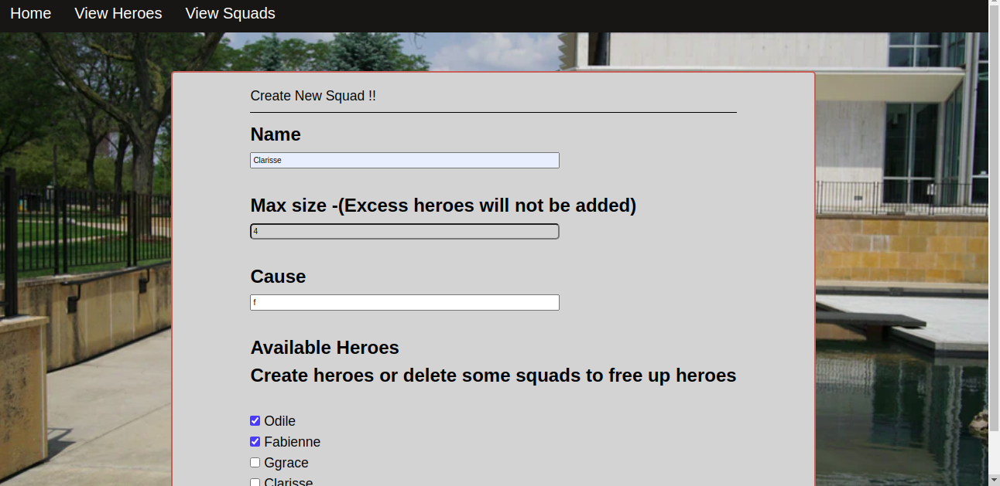
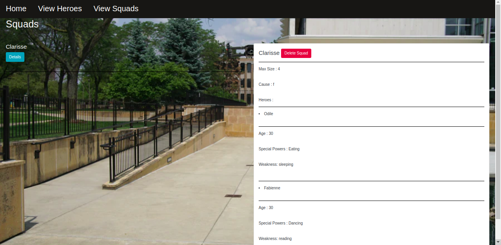

# Hero Squad

## Author name 

Clarisse Uwizeyimana

## Description of project:

This app allows you to recruit a well-balanced team of superheroes where you create a hero and you put him/her in a squard once. You can also delete the squad or hero when you no longer need him /her
## project setup instructions:

You have to open yur terminal(Ctrl+Alt+T) You have to clone this project by using this link 
https://github.com/Clarisse-3924/Squad.git

## Contact

That is my contact in case you want to contact. Email: cuwizeyimana820@daviscollege.com

## Home image

## Home page view after signing

## create hero

## Viewing hero

## Creating squad

## Viewing squad

## Copyright and license information
Information MIT license and Copyright@2020